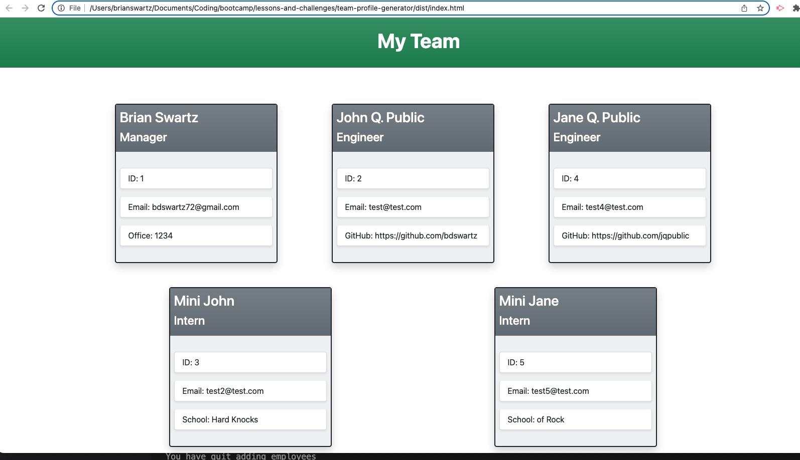

# [Welcome to the Team Generator](https://github.com/bdswartz/team-profile-generator)

#### Team Profile Generator uses node.js to run a command line application that takes user input to capture the members of the team and then build a formatted HTML output to display the members of the team.
---

#### Collaborators:
* [Brian Swartz](https://github.com/bdswartz)

---

## Installation
npm i

---

## Usage
run node index.js
[Video Showing Use](./assets/use-video.mov)

---

## User Story
### AS A manager
I WANT to generate a webpage that displays my team's basic info
SO THAT I have quick access to their emails and GitHub profiles
    
### Acceptance Criteria for Minimum Viable Product

GIVEN a weather dashboard with form inputs

*  GIVEN a command-line application that accepts user input
*  WHEN I am prompted for my team members and their information
    THEN an HTML file is generated that displays a nicely formatted team roster based on user input
*  WHEN I click on an email address in the HTML
    THEN my default email program opens and populates the TO field of the email with the address
*  WHEN I click on the GitHub username
    THEN that GitHub profile opens in a new tab
*  WHEN I start the application
    THEN I am prompted to enter the team manager’s name, employee ID, email address, and office number
*  WHEN I enter the team manager’s name, employee ID, email address, and office number
    THEN I am presented with a menu with the option to add an engineer or an intern or to finish building my team
*  WHEN I select the engineer option
    THEN I am prompted to enter the engineer’s name, ID, email, and GitHub username, and I am taken back to the menu
*  WHEN I select the intern option
    THEN I am prompted to enter the intern’s name, ID, email, and school, and I am taken back to the menu
*  WHEN I decide to finish building my team
    THEN I exit the application, and the HTML is generated

---

## Technologies

> <b>Development Tools:</b>
  * Node.js
    * Inquirer
    * File System
    * Jest testing package
  * JavaScript
  * HTML (to create application output)
  * Bootstrap (to reduce number of files by not including a style sheet)

---

## Features And Functionality
Team Generator is designed to create an HTML page output based on user input at the command line. Features that are included in the application include the following:
*  Ability to enter three different classes of employees (Manager, Engineer, Intern)
*  Basic information displayed in card format on the HTML output.
*  Basic information corresponds to the class of employee that is displayed.
*  No need for a separate CSS stylesheet through use of Bootstrap CDN link in the HTML output.
*  Working link to user's default email program upon clicking on each employee's email.
*  Working link to each Engineer's GitHub account.

---

## Tests
npm test - Uses Jest testing package.

Screen shot of the html output rendered in Google Chrome 

